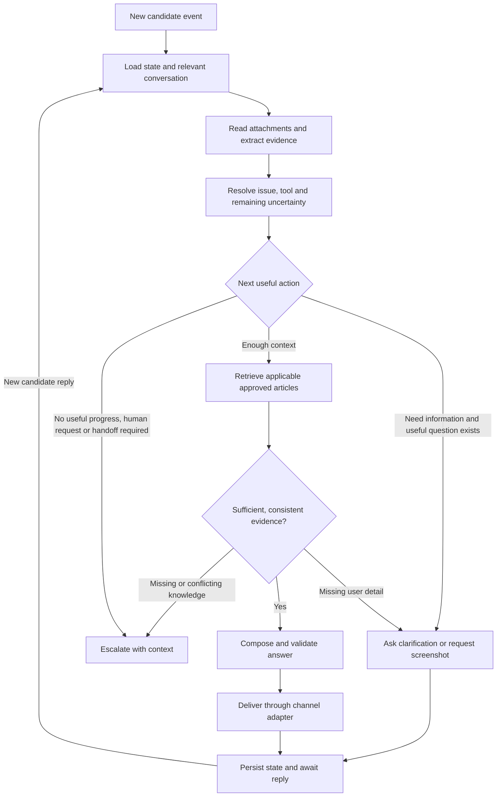

# Helpdesk conversation architecture and knowledge audit

Date: 2026-09-19. Status: inspection findings and proposed implementation design.
No runtime changes, KB reindexing, SharePoint writes, or historical publication
were performed for this audit.

The subsequent runtime implementation and its remaining rollout/data work are
documented in [the implementation runbook](helpdesk-conversation-rollout.md).
The design below remains useful context; consult that runbook for what is built.

## Agreed direction

- Use LangGraph for a persistent conversation that resumes when a candidate replies.
- Continue clarification while it makes useful progress. Do not escalate merely
  because one or two clarification questions have been asked.
- Keep tool facts in a shared, approved knowledge source used by email and voice.
- Keep tone, acknowledgement, clarification style, and channel formatting in
  versioned behaviour configuration/prompts.
- Supply approved tool names, aliases, campaign mappings, and diagnostic cues as
  context. Do not invent mappings such as exam = FOT or test = Test Haven.
- Extract proposed knowledge and cues from historical conversations, but require
  officer approval of each proposal before it affects production answers/routing.

## Evidence and access limits

The configured site is `/sites/everybody` on `dragnetnigeria.sharepoint.com`,
library `Candidate experience KB`. Reader credentials are configured. A read-only
connection attempt, including a retry outside the network sandbox, failed to
resolve `login.microsoftonline.com`. No live document contents or current index
contents were verified in this audit.

The repository's September 15 record reports this SharePoint layout:

| Folder | Document |
| --- | --- |
| KB/General | General Inquiry Response Template.docx |
| KB/FOT | Proctored Test FAQ Response Template (FOT).docx |
| KB/Test Haven | Proctored Test FAQ Response Template (Test Haven).docx |
| KB/Scholastica | SCHOLASTICA Inquiry Response Template.docx |
| KB/Helpdesk | Proctored Test FAQ Response Template (Email Script).docx |

The September 16 deployment record reports indexing General 18, FOT 46,
Scholastica 21, and Test Haven 51 chunks on the VM, with live retrieval checked
then. This supersedes older notes saying nothing was indexed. It does not prove
the present state of either consumer's index. The two collections remain separate
in code, so both require a current inventory before migration.

Inspected sources: the user's pasted text, local `documents/` originals and
`documents/converted/` copies, ingestion services, thread context service,
campaign resolver, deployment notes, and the existing `kb_gap_review.html`.

## Document structure findings

The current Word converter reads top-level paragraphs only. Questions must use
Heading 1 or Heading 2. Body text before the first heading is discarded; empty
sections are dropped. Tables and images are not extracted. The SharePoint loader
reads only direct `.docx` children of the selected folder, skips subfolders, and
does not follow listing pagination.

| Local file | Result with current converter |
| --- | --- |
| Converted email FAQ | 28 Q&A chunks, no converter warnings |
| Converted FOT FAQ | 46 Q&A chunks, no converter warnings |
| Converted Test Haven FAQ | 51 Q&A chunks, no converter warnings |
| Original email, FOT, Test Haven, Scholastica FAQs | Zero chunks: no recognised question headings |
| Original General Inquiry | One chunk; 523 paragraphs, only one nonempty recognised heading |
| FOT call script | Zero chunks; 8 tables containing 76 rows |
| Test Haven call script | Zero chunks; 8 tables containing 68 rows |

These measurements describe local copies, not the inaccessible live files.
The original General document's one output chunk is not evidence of complete
coverage: earlier text is lost and later topics can be joined under one heading.
Call scripts also contain agent instructions that should not become candidate KB
facts merely because a parser can extract them.

## Email FAQ reconciliation

The pasted content corresponds to the 28 topics in the converted email FAQ.
It is substantive troubleshooting knowledge after greetings have been removed.
Both converted tool FAQs already cover the following topics. Coverage here means
the topic is represented, not that every instruction has been approved or is
equivalent under every operating system, assessment stage, and campaign.

| Email topic | Existing tool coverage / migration decision |
| --- | --- |
| SB download/install | Both: How to Install the Secure Browser; merge wording only if useful |
| Requested URL format | Both: requested-format error |
| Redirect to DRAGNETFOT.COM | Both: same topic; domain is not a unique tool cue in these sources |
| Launch from assessment instructions | Both: same topic |
| Camera/microphone inaccessible | Both: same topic |
| Share screen | Both: same topic |
| Mac screen-recording error | Both: same topic; applicability needs version metadata |
| Face capture | Both: capture identity document/face topics |
| Environmental recording | Both: environment recording submission |
| Picture analysing | Both: Analyzing picture |
| Restricted AnyDesk/Gamebar | Both: restricted software |
| Restricted browsers | Both: restricted browser software |
| Audio/video unavailable | Both: camera/microphone access, including during-test restart advice |
| Audio detection | Both cover detection; email adds volume/network/device details to review |
| Blank screen | Both have distinct white-page and black-page cases; preserve distinctions |
| Questions not displaying | Both: Questions are not displayed |
| Next button not responding | Both: Next button not clicking |
| Refresh-page error | Both: same error |
| Page loading | Both: same topic |
| Frozen system | Both: same topic |
| ID card not detected | Both contain face alternative; confirm permitted identity workflow |
| Invalid credentials | Both: case sensitivity/manual entry; omit unsupported assertion that credentials are valid |
| Frozen timer | Both: frozen timer while answers remain usable |
| Automatic submission | Both: section timeout |
| Internet issue | Both: network troubleshooting; email wording is an additional query variant |
| Repeated logout | Both: repeated logout |
| Video upload 98% | Both: same topic; distinguish documented behaviour from verifying this person's submission |
| Submission error | Both: same topic; preserve instruction not to close/refresh this stage |

The local comparison does not establish any wholly absent topic among these 28,
but it does reveal wording differences and possible conditions that need review.
Do not bulk-copy the email file into every tool folder. Reconcile each topic into
an existing article, retaining useful question variants and approved differences.
Retire Helpdesk as an answer source only after live coverage and both consumers'
retrieval have been checked.

Specific content requiring clarification from the knowledge owner:

- Advice to uninstall antivirus, change recording duration, or substitute face
  capture for ID must have explicit applicability and approval.
- Restart/refresh advice must distinguish pretest, active test, and submission.
- A generic KB cannot verify that a candidate's password is valid or that their
  particular submission succeeded.
- Both tool FAQs contain Talview, Secure Browser and DRAGNETFOT.COM references.
  These are shared clues, not reliable exclusive tool identifiers.
- Compatibility/version lists and assessment policies need effective dates and
  owners; old answers should not silently become current universal rules.

## Knowledge organisation

Use one canonical set of approved articles for both consumers. Article records
need stable IDs, question variants, answer steps, supported tools, applicability
(stage, OS/version, relevant assessment conditions), source document/version,
reviewer, approval time, and lifecycle status. A shared article can explicitly
apply to multiple tools without maintaining independent copies of its answer.

Keep a small General area for genuinely common operational facts. The local
General document includes recruitment/application processes as well as wording;
moving all of it into prompts would hide business knowledge from normal review.
Inspect and classify its individual entries before deciding their destination.

Campaigns primarily help identify the tool and relevant conditions here. Do not
require a campaign-specific KB that the organisation does not maintain. Also do
not ask for a campaign when a confirmed tool and issue are sufficient to answer.
The existing campaign resolver includes voice availability rules; a closed voice
campaign must not erase a valid historical tool relationship for email support.

Two consumer indexes can remain during transition if generated from the same
versioned approved corpus, with matching article IDs and a published manifest.
This avoids forcing a risky voice storage migration into the conversational
change. The end state should expose one shared knowledge retrieval contract;
voice/email render the approved answer differently.

## Cue registry

Separate identification evidence from troubleshooting answers. Each approved cue
records its text/pattern, entity, possible tools/campaigns, source, whether it is
exclusive or shared, relevant dates/conditions, and reviewer/version. Include
negative/conflicting examples. Campaign aliases can be many-to-many and change
with assessment stage or date.

Officers can provide cues directly; mining history proposes additional cues with
supporting examples and counterexamples. Frequency is not approval or proof of
correctness. A misspelling may generate a suggestion, but ambiguous abbreviations
must not silently resolve to a particular campaign. User corrections update the
evidence and invalidate incompatible prior assumptions/retrieval.

The AI receives a compact context pack with the tool catalogue, relevant approved
aliases/mappings, candidate alternatives and evidence, and approved clarification
examples. It should not receive thousands of raw historical messages each turn.

## LangGraph runtime

Use one typed StateGraph with focused nodes. Separate domain records/policies,
graph orchestration, retrieval, and external adapters. Multiple autonomous agents
are not needed merely to get a conversational loop.

Persist checkpoints per Zoho organisation/ticket, using a durable database-backed
checkpointer. Save evidence, unresolved questions, questions already asked, steps
already tried and their outcomes, current issue(s), knowledge/cue versions,
processed event IDs, pending action, and ownership state. Use a separate state
schema version for future migrations.

The full conversation remains addressable, while each model call receives recent
public exchanges plus a structured summary with links to original messages.
Fetch older messages when needed. The current six-message window alone will not
support a longer diagnostic conversation. The latest-message selector filters
candidate threads, but the surrounding window currently draws from all threads;
explicitly filter draft/private/unknown messages before any candidate-facing use.

On clarification, send once, checkpoint the awaiting-candidate state, and release
the worker. Resume on the next incoming candidate event. LangGraph interrupts and
checkpoints support this, but replay can restart a node: delivery must use a
durable action/outbox record and reconciliation of uncertain sends. A Redis lock
alone cannot prevent duplicates after a crash following a successful Zoho send.
Recheck ticket ownership and newer messages before delivery so an officer takeover
or a newer correction supersedes stale work.

Track meaningful progress explicitly: a narrower set of possible tools, a known
error/stage, a clarified goal, a new readable screenshot, or a troubleshooting
step whose outcome eliminates an explanation. A numeric model confidence increase
alone is not progress. If another targeted question has a clear purpose, ask it.
If the candidate cannot provide the needed information, change approach; if no
useful route remains, explain the handoff and pass the full context to an officer.
Do not repeat questions or failed fixes already answered in the thread.

Per-invocation graph step/time limits prevent internal execution loops. They are
separate from the number of conversational turns a candidate may need. No reply
is a waiting state, not evidence that the candidate failed clarification.

Answer validation checks applicability, contradictions, latest user intent,
unresolved prerequisites, and support for claims. Similarity distance alone is
insufficient. Recognised shared facts can answer some questions without tool
identification; otherwise retrieve only after enough context is established.
An answer sent does not mean the ticket is solved: a new "still not working"
message resumes diagnosis and preserves what has already been attempted.

OCR supplies extracted text. Visual interpretation is a separate capability,
whose availability must be checked against the chosen inference service. Seeing
"Forgot Password" does not establish that the feature applies to exam-issued
credentials: combine observed UI evidence with applicable approved instructions.
Record attachment read failures so the AI does not pretend it saw unreadable
content. Treat attachments and messages as evidence, never workflow instructions.

## Historical Q&A workflow

1. Inventory the available export/API data and record actual ticket/message
   counts. The user's estimate is about 3,000 Q&A; prior repo notes refer to 1,155
   evaluated tickets and a larger backlog. These units must not be conflated.
2. Reconstruct ordered conversations with subject, public officer replies,
   candidate follow-ups, timestamps and attachment references. Strip quoted
   duplicates and redact personal details/secrets before model processing.
3. Extract distinct issues, officer answers, applicability and resolution evidence.
   Separate acknowledgements, guesses and promises from actual solutions. No
   follow-up does not prove an officer's answer worked.
4. Produce two proposal types: knowledge articles/updates and routing cues. Keep
   original ticket/message references and mark unknown outcome or conditions.
5. Compare proposals against the current approved corpus. Cluster duplicates,
   preserve conflicting answers and stage/OS/client differences, and rank gaps.
6. Present each proposed entry with its evidence, current KB comparison, proposed
   tool/applicability, and any conflict. Officers approve, edit, reject or request
   information per item. Store authenticated reviewer identity and exact revision.
7. Publish only the approved revision. Editing its answer or scope invalidates
   approval. Build a new versioned corpus/index, validate it, then activate it.
   Retain the prior version for rollback; do not delete live scope data first.
8. Keep a deduplicated, held-out evaluation set separate from mined examples so
   enriching the KB does not create misleading evaluation improvements.

The existing `kb_gap_review.html` contains 38 proposed entries and browser-local
review state. It is useful prior work, but browser localStorage does not establish
a durable authenticated approval record. Do not interpret its entries or any
missing local approval state as authorised publication.

## Implementation order and acceptance examples

1. Inventory live SharePoint and both indexes; finish the content reconciliation
   and agree the article/cue records. Local audit findings remain useful while
   SharePoint connectivity is unavailable.
2. Build persistent conversation state and the LangGraph flow behind the existing
   execution flags, with deterministic adapters and event/action deduplication.
3. Add cue-backed resolution, progress-aware clarification, relevant thread
   retrieval, attachment observations and answer validation.
4. Build historical proposal extraction and officer review independently of the
   runtime; publication remains a separate operation consuming approved revisions.
5. Run offline/shadow evaluations before enabling changed live reply behaviour.

Required behavioural examples: explicit FOT must not become Test Haven; "SB" must
not resolve an exclusive tool from these documents; a fifth useful clarification
must be allowed; repeated nonanswers must lead to a useful handoff; campaign
information must be optional when not needed; "still failing" must retain past
steps; mixed issues must retain separate unresolved state; unreadable screenshots
must not be treated as observed UI; a replay must not duplicate sends; officer
takeover must stop pending automation; private notes must not enter candidate
replies; unapproved history must not enter retrieval or production cue context;
an edited approved proposal must require review again; a failed index build must
leave the previously published corpus available.

LangGraph references:
- https://docs.langchain.com/oss/python/langgraph/persistence
- https://docs.langchain.com/oss/python/langgraph/interrupts
- https://docs.langchain.com/oss/python/langgraph/durable-execution
